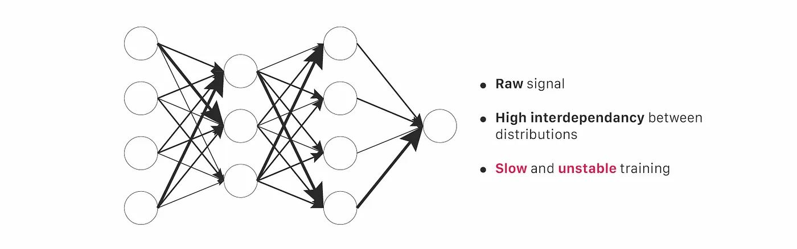
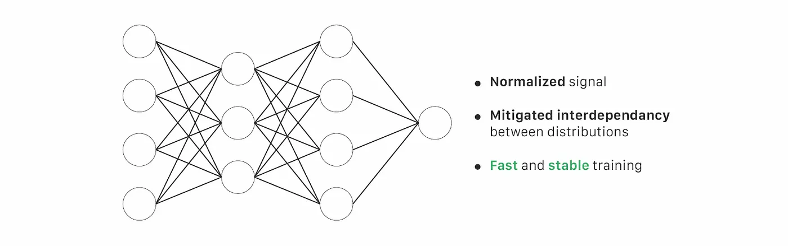

# Pytorch-01
Me messing with Pytorch

Hi All,

Well this is me showcasing my pytorch skills by doing some thing useful.

We all use batch normalization before feeding input to the next layer in Neural Networks so today I am gonna show you performance difference between model with normalization and without.

If you wonder what is Batch Normalization here is a simple def for it.

A) In 30 seconds
Batch-Normalization (BN) is an algorithmic method which makes the training of Deep Neural Networks (DNN) faster and more stable.

It consists of normalizing activation vectors from hidden layers using the first and the second statistical moments (mean and variance) of the current batch. This normalization step is applied right before (or right after) the nonlinear function.

Multilayer Perceptron (MLP) without batch normalization (BN) | Credit : author - Design : Lou HD

Multilayer Perceptron (MLP) with batch normalization (BN) | Credit : author - Design : Lou HD
All the current deep learning frameworks have already implemented methods which apply batch normalization. It is usually used as a module which could be inserted as a standard layer in a DNN.

Remark : For those who prefer read code than text, I wrote this simple implementation of Batch Normalization in this repo.

